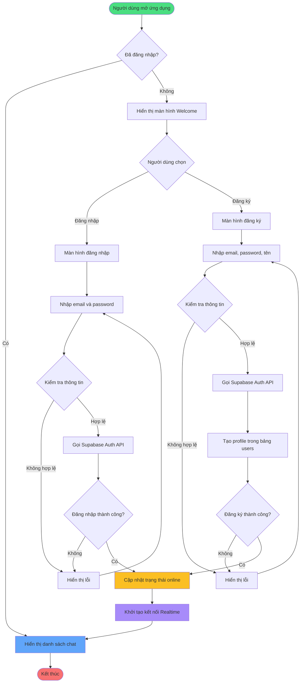

# Sơ đồ hoạt động 1: Xác thực người dùng (Authentication Flow)

## Mô tả luồng hoạt động

### 1. Kiểm tra trạng thái đăng nhập
- Ứng dụng sử dụng `StreamBuilder` để lắng nghe `auth.onAuthStateChange`
- Nếu có session, chuyển đến màn hình chat
- Nếu không, hiển thị màn hình Welcome

### 2. Đăng nhập (Login)
- Người dùng nhập email và password
- Validate dữ liệu đầu vào
- Gọi `AuthService.signIn()` → `supabase.auth.signInWithPassword()`
- Nếu thành công, cập nhật trạng thái online và khởi tạo Realtime

### 3. Đăng ký (Register)
- Người dùng nhập email, password và tên đầy đủ
- Validate dữ liệu đầu vào
- Gọi `AuthService.signUp()` → `supabase.auth.signUp()`
- Tạo bản ghi trong bảng `users` với thông tin profile
- Nếu thành công, tự động đăng nhập và chuyển đến màn hình chat

### 4. Khởi tạo Realtime
- Thiết lập kết nối WebSocket với Supabase Realtime
- Subscribe các channel cần thiết (messages, typing indicators, online status)

## Services liên quan
- `AuthService`: Xử lý authentication
- `UserService`: Quản lý thông tin người dùng và trạng thái online
