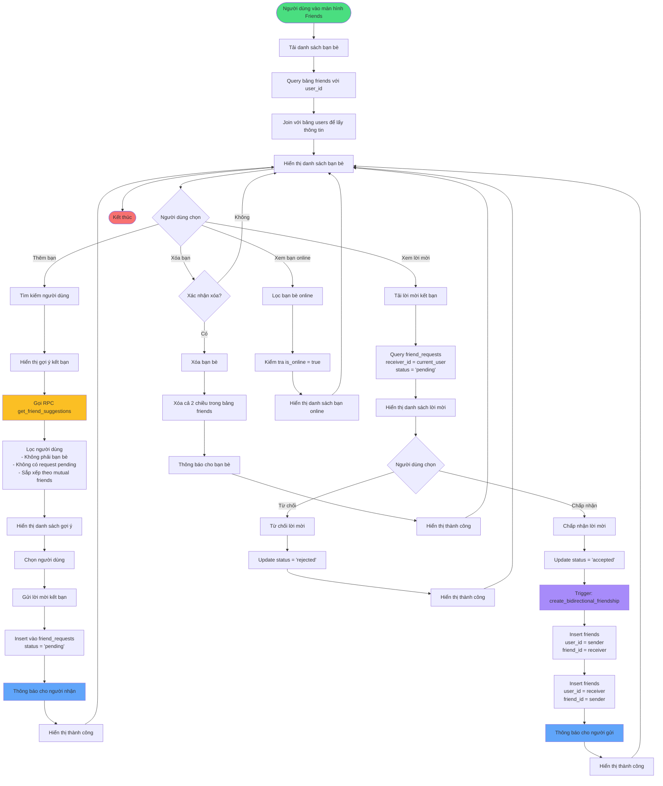

# Sơ đồ hoạt động 2: Quản lý bạn bè (Friend Management Flow)

## Mô tả luồng hoạt động

### 1. Tải danh sách bạn bè
- Query bảng `friends` với `user_id = current_user`
- Join với bảng `users` để lấy thông tin chi tiết (tên, avatar, trạng thái online)
- Hiển thị danh sách với trạng thái online/offline

### 2. Gửi lời mời kết bạn
- Tìm kiếm người dùng hoặc xem gợi ý
- Gọi RPC function `get_friend_suggestions()` để lấy danh sách gợi ý dựa trên:
  - Số lượng bạn chung (mutual friends)
  - Người dùng chưa là bạn bè
  - Chưa có lời mời pending
- Insert vào bảng `friend_requests` với status = 'pending'

### 3. Chấp nhận lời mời kết bạn
- Update status = 'accepted' trong bảng `friend_requests`
- Trigger `on_friend_request_accepted` tự động chạy
- Function `create_bidirectional_friendship()` tạo 2 bản ghi trong bảng `friends`:
  - user_id = sender, friend_id = receiver
  - user_id = receiver, friend_id = sender

### 4. Từ chối lời mời
- Update status = 'rejected' trong bảng `friend_requests`
- Không tạo bản ghi trong bảng `friends`

### 5. Xóa bạn bè
- Xóa cả 2 chiều trong bảng `friends`
- Đảm bảo cả 2 người dùng đều không còn là bạn bè

### 6. Xem bạn bè online
- Lọc danh sách bạn bè với `is_online = true`
- Sử dụng Realtime để cập nhật trạng thái online/offline tự động

## Services liên quan
- `FriendService`: Quản lý tất cả logic liên quan đến bạn bè
- Database Functions:
  - `get_friend_suggestions()`: Gợi ý kết bạn dựa trên mutual friends
  - `create_bidirectional_friendship()`: Tạo quan hệ bạn bè 2 chiều

## Row Level Security (RLS)
- Users chỉ có thể xem bạn bè của chính họ
- Users chỉ có thể gửi lời mời với sender_id = auth.uid()
- Users chỉ có thể chấp nhận/từ chối lời mời nhận được
