# Sơ đồ hoạt động 6: Xử lý Media (Media Handling Flow)

```mermaid
flowchart TD
    Start([Người dùng muốn gửi media]) --> SelectType{Chọn loại media}
    
    %% Image Flow
    SelectType -->|Ảnh| SelectImageSource{Chọn nguồn ảnh}
    SelectImageSource -->|Camera| OpenCamera[Mở camera]
    SelectImageSource -->|Thư viện| OpenGallery[Mở thư viện ảnh]
    
    OpenCamera --> CaptureImage[Chụp ảnh]
    OpenGallery --> PickImage[Chọn ảnh]
    
    CaptureImage --> ValidateImage{Kiểm tra ảnh}
    PickImage --> ValidateImage
    
    ValidateImage -->|Quá lớn| ShowImageError[Hiển thị lỗi: Ảnh quá lớn<br/>Tối đa 10MB]
    ShowImageError --> SelectImageSource
    ValidateImage -->|Sai định dạng| ShowFormatError[Hiển thị lỗi: Định dạng không hỗ trợ<br/>Chỉ hỗ trợ: JPG, PNG, GIF, WEBP]
    ShowFormatError --> SelectImageSource
    
    ValidateImage -->|Hợp lệ| CompressImage[Nén ảnh nếu cần]
    CompressImage --> GenerateImageThumb[Tạo thumbnail]
    GenerateImageThumb --> UploadImage[Upload ảnh lên Storage]
    
    %% Video Flow
    SelectType -->|Video| SelectVideoSource{Chọn nguồn video}
    SelectVideoSource -->|Camera| RecordVideo[Quay video]
    SelectVideoSource -->|Thư viện| PickVideo[Chọn video]
    
    RecordVideo --> ValidateVideo{Kiểm tra video}
    PickVideo --> ValidateVideo
    
    ValidateVideo -->|Quá lớn| ShowVideoError[Hiển thị lỗi: Video quá lớn<br/>Tối đa 100MB]
    ShowVideoError --> SelectVideoSource
    ValidateVideo -->|Quá dài| ShowDurationError[Hiển thị lỗi: Video quá dài<br/>Tối đa 5 phút]
    ShowDurationError --> SelectVideoSource
    
    ValidateVideo -->|Hợp lệ| CompressVideo[Nén video nếu cần]
    CompressVideo --> ExtractVideoThumb[Trích xuất thumbnail từ frame đầu]
    ExtractVideoThumb --> GetVideoDuration[Lấy thời lượng video]
    GetVideoDuration --> UploadVideo[Upload video lên Storage]
    
    %% Audio Flow
    SelectType -->|Audio| SelectAudioSource{Chọn nguồn audio}
    SelectAudioSource -->|Ghi âm| StartRecording[Bắt đầu ghi âm]
    StartRecording --> ShowRecordingUI[Hiển thị UI ghi âm<br/>với timer và waveform]
    ShowRecordingUI --> RecordingAction{Người dùng chọn}
    
    RecordingAction -->|Dừng| StopRecording[Dừng ghi âm]
    RecordingAction -->|Hủy| CancelRecording[Hủy ghi âm]
    CancelRecording --> Start
    
    StopRecording --> ValidateAudio{Kiểm tra audio}
    ValidateAudio -->|Quá ngắn| ShowAudioError1[Hiển thị lỗi: Audio quá ngắn<br/>Tối thiểu 1 giây]
    ShowAudioError1 --> StartRecording
    ValidateAudio -->|Quá dài| ShowAudioError2[Hiển thị lỗi: Audio quá dài<br/>Tối đa 10 phút]
    ShowAudioError2 --> StartRecording
    
    SelectAudioSource -->|Chọn file| PickAudioFile[Chọn file audio]
    PickAudioFile --> ValidateAudio
    
    ValidateAudio -->|Hợp lệ| GetAudioDuration[Lấy thời lượng audio]
    GetAudioDuration --> UploadAudio[Upload audio lên Storage]
    
    %% File Flow
    SelectType -->|File| OpenFilePicker[Mở file picker]
    OpenFilePicker --> PickFile[Chọn file]
    PickFile --> ValidateFile{Kiểm tra file}
    
    ValidateFile -->|Quá lớn| ShowFileError[Hiển thị lỗi: File quá lớn<br/>Tối đa 50MB]
    ShowFileError --> OpenFilePicker
    ValidateFile -->|Loại file bị cấm| ShowBlockedError[Hiển thị lỗi: Loại file không được phép<br/>Không hỗ trợ: .exe, .bat, .sh]
    ShowBlockedError --> OpenFilePicker
    
    ValidateFile -->|Hợp lệ| GetFileInfo[Lấy thông tin file<br/>tên, kích thước, loại]
    GetFileInfo --> UploadFile[Upload file lên Storage]
    
    %% Upload Process
    UploadImage --> UploadProcess[Quy trình upload]
    UploadVideo --> UploadProcess
    UploadAudio --> UploadProcess
    UploadFile --> UploadProcess
    
    UploadProcess --> GenerateFileName[Tạo tên file unique<br/>userId_timestamp_random]
    GenerateFileName --> DetermineFolder[Xác định folder trong Storage<br/>images/, videos/, audios/, files/]
    DetermineFolder --> ShowProgress[Hiển thị progress bar]
    ShowProgress --> UploadToSupabase[Upload lên Supabase Storage]
    
    UploadToSupabase --> UploadSuccess{Upload thành công?}
    UploadSuccess -->|Không| HandleUploadError{Loại lỗi}
    HandleUploadError -->|Network| ShowNetworkError[Hiển thị lỗi: Mất kết nối<br/>Thử lại?]
    ShowNetworkError --> RetryUpload{Thử lại?}
    RetryUpload -->|Có| UploadToSupabase
    RetryUpload -->|Không| Start
    
    HandleUploadError -->|Storage full| ShowStorageError[Hiển thị lỗi: Storage đầy<br/>Liên hệ admin]
    ShowStorageError --> Start
    
    HandleUploadError -->|Permission| ShowPermError[Hiển thị lỗi: Không có quyền<br/>Kiểm tra RLS policies]
    ShowPermError --> Start
    
    UploadSuccess -->|Có| GetPublicURL[Lấy public URL của file]
    GetPublicURL --> CreateMetadata[Tạo metadata]
    CreateMetadata --> StoreMetadata{Loại media}
    
    StoreMetadata -->|Image| StoreImageMeta[Lưu metadata:<br/>width, height, size, format]
    StoreMetadata -->|Video| StoreVideoMeta[Lưu metadata:<br/>duration, size, format, thumbnail_url]
    StoreMetadata -->|Audio| StoreAudioMeta[Lưu metadata:<br/>duration, size, format]
    StoreMetadata -->|File| StoreFileMeta[Lưu metadata:<br/>filename, size, mime_type]
    
    StoreImageMeta --> InsertMessage[Insert message vào database]
    StoreVideoMeta --> InsertMessage
    StoreAudioMeta --> InsertMessage
    StoreFileMeta --> InsertMessage
    
    InsertMessage --> SetMessageType[Set message type:<br/>image/video/audio/file]
    SetMessageType --> SetMediaURL[Set media_url = public URL]
    SetMediaURL --> SetDuration[Set duration nếu có]
    SetDuration --> BroadcastMessage[Broadcast tin nhắn qua Realtime]
    BroadcastMessage --> ShowSuccess[Hiển thị thành công]
    
    ShowSuccess --> DisplayInChat[Hiển thị trong chat]
    DisplayInChat --> RenderMedia{Render media}
    
    %% Render Media
    RenderMedia -->|Image| ShowImagePreview[Hiển thị ảnh với thumbnail<br/>Click để xem full size]
    RenderMedia -->|Video| ShowVideoPlayer[Hiển thị video player<br/>với thumbnail và play button]
    RenderMedia -->|Audio| ShowAudioPlayer[Hiển thị audio player<br/>với waveform và controls]
    RenderMedia -->|File| ShowFileCard[Hiển thị file card<br/>với icon, tên, kích thước]
    
    ShowImagePreview --> MediaActions
    ShowVideoPlayer --> MediaActions
    ShowAudioPlayer --> MediaActions
    ShowFileCard --> MediaActions
    
    MediaActions{Người dùng chọn} -->|Download| DownloadMedia[Download media về máy]
    MediaActions -->|Share| ShareMedia[Chia sẻ media]
    MediaActions -->|Delete| DeleteMedia[Xóa media]
    
    DownloadMedia --> SaveToDevice[Lưu vào thiết bị]
    SaveToDevice --> ShowDownloadSuccess[Hiển thị thành công]
    ShowDownloadSuccess --> End
    
    ShareMedia --> OpenShareSheet[Mở share sheet của OS]
    OpenShareSheet --> End
    
    DeleteMedia --> ConfirmDelete{Xác nhận xóa?}
    ConfirmDelete -->|Không| End
    ConfirmDelete -->|Có| DeleteFromStorage[Xóa khỏi Storage]
    DeleteFromStorage --> DeleteMessageRecord[Xóa/Update message record]
    DeleteMessageRecord --> BroadcastDelete[Broadcast delete event]
    BroadcastDelete --> ShowDeleteSuccess[Hiển thị thành công]
    ShowDeleteSuccess --> End
    
    End([Kết thúc])
    
    style Start fill:#4ade80
    style End fill:#f87171
    style UploadToSupabase fill:#a78bfa
    style BroadcastMessage fill:#fbbf24
    style CompressImage fill:#60a5fa
    style CompressVideo fill:#60a5fa
    style ShowProgress fill:#34d399
```



## Mô tả luồng hoạt động

### 1. Gửi ảnh (Image)

**Nguồn ảnh:**
- Camera: Chụp ảnh trực tiếp
- Thư viện: Chọn từ thư viện ảnh

**Validation:**
- Kích thước tối đa: 10MB
- Định dạng hỗ trợ: JPG, PNG, GIF, WEBP
- Kiểm tra file có bị corrupt không

**Xử lý:**
1. Nén ảnh nếu > 2MB (giữ chất lượng 85%)
2. Tạo thumbnail (300x300px) để hiển thị nhanh
3. Upload cả ảnh gốc và thumbnail lên Storage
4. Lưu metadata: width, height, size, format

**Hiển thị:**
- Hiển thị thumbnail trong chat
- Click để xem full size với zoom/pan
- Swipe để xem ảnh trước/sau

### 2. Gửi video (Video)

**Nguồn video:**
- Camera: Quay video trực tiếp
- Thư viện: Chọn từ thư viện video

**Validation:**
- Kích thước tối đa: 100MB
- Thời lượng tối đa: 5 phút
- Định dạng hỗ trợ: MP4, MOV, AVI

**Xử lý:**
1. Nén video nếu cần (giảm bitrate, resolution)
2. Trích xuất thumbnail từ frame đầu tiên
3. Lấy thời lượng video
4. Upload video và thumbnail lên Storage
5. Lưu metadata: duration, size, format, thumbnail_url

**Hiển thị:**
- Hiển thị thumbnail với play button
- Hiển thị thời lượng video
- Click để play inline hoặc fullscreen
- Controls: play/pause, seek, volume, fullscreen

### 3. Gửi audio (Audio)

**Nguồn audio:**
- Ghi âm: Ghi âm trực tiếp từ mic
- File: Chọn file audio có sẵn

**Ghi âm:**
- Hiển thị UI với timer và waveform realtime
- Tối thiểu: 1 giây
- Tối đa: 10 phút
- Format: AAC hoặc MP3

**Validation:**
- Kích thước tối đa: 20MB
- Định dạng hỗ trợ: MP3, AAC, WAV, M4A

**Xử lý:**
1. Nén audio nếu cần (giảm bitrate)
2. Lấy thời lượng audio
3. Upload lên Storage
4. Lưu metadata: duration, size, format

**Hiển thị:**
- Audio player với waveform
- Controls: play/pause, seek, speed (1x, 1.5x, 2x)
- Hiển thị thời lượng và progress

### 4. Gửi file (File)

**Loại file:**
- Documents: PDF, DOC, DOCX, XLS, XLSX, PPT, PPTX
- Archives: ZIP, RAR, 7Z
- Text: TXT, CSV, JSON, XML
- Code: JS, PY, JAVA, etc.

**Validation:**
- Kích thước tối đa: 50MB
- Loại file bị cấm: .exe, .bat, .sh, .cmd (security)

**Xử lý:**
1. Lấy thông tin file: tên, kích thước, MIME type
2. Upload lên Storage
3. Lưu metadata: filename, size, mime_type

**Hiển thị:**
- File card với icon tương ứng loại file
- Tên file và kích thước
- Button download
- Preview cho PDF, images, text files

### 5. Upload Process

**Quy trình upload:**
1. Generate unique filename: `{userId}_{timestamp}_{random}.{ext}`
2. Xác định folder trong Storage:
   - `images/` cho ảnh
   - `videos/` cho video
   - `audios/` cho audio
   - `files/` cho file khác
3. Hiển thị progress bar (0-100%)
4. Upload lên Supabase Storage với RLS policies
5. Lấy public URL sau khi upload thành công

**Error Handling:**
- **Network error**: Cho phép retry
- **Storage full**: Thông báo liên hệ admin
- **Permission error**: Kiểm tra RLS policies
- **Timeout**: Retry với exponential backoff

### 6. Storage Structure

```
supabase-storage/
├── images/
│   ├── {userId}_{timestamp}_abc123.jpg
│   └── thumbnails/
│       └── {userId}_{timestamp}_abc123_thumb.jpg
├── videos/
│   ├── {userId}_{timestamp}_xyz789.mp4
│   └── thumbnails/
│       └── {userId}_{timestamp}_xyz789_thumb.jpg
├── audios/
│   └── {userId}_{timestamp}_def456.m4a
└── files/
    └── {userId}_{timestamp}_document.pdf
```

### 7. Metadata Storage

**Lưu trong bảng `media_metadata`:**
```sql
CREATE TABLE media_metadata (
  id UUID PRIMARY KEY,
  message_id UUID REFERENCES messages(id),
  media_type TEXT, -- image/video/audio/file
  media_url TEXT,
  thumbnail_url TEXT,
  filename TEXT,
  size BIGINT,
  width INTEGER, -- for images
  height INTEGER, -- for images
  duration INTEGER, -- for video/audio (seconds)
  mime_type TEXT,
  created_at TIMESTAMP
);
```

### 8. Download & Share

**Download:**
- Download file từ public URL
- Lưu vào thư mục Downloads của thiết bị
- Hiển thị notification khi hoàn thành

**Share:**
- Sử dụng native share sheet của OS
- Share URL hoặc file trực tiếp
- Hỗ trợ share đến các app khác

### 9. Delete Media

**Quyền xóa:**
- Người gửi có thể xóa media của mình
- Admin nhóm có thể xóa media trong nhóm

**Quy trình:**
1. Xác nhận xóa
2. Xóa file khỏi Storage
3. Update/Delete message record
4. Broadcast delete event cho tất cả clients
5. Clients cập nhật UI (hiển thị "Tin nhắn đã bị xóa")

## Tối ưu hóa

### 1. Compression
- **Images**: Nén với quality 85%, resize nếu > 2048px
- **Videos**: Giảm bitrate, resize xuống 720p nếu > 1080p
- **Audio**: Giảm bitrate xuống 128kbps

### 2. Thumbnail Generation
- Tạo thumbnail ngay sau khi upload
- Sử dụng thumbnail để hiển thị nhanh trong chat
- Lazy load ảnh/video gốc khi cần

### 3. Progressive Upload
- Upload theo chunks (1MB/chunk)
- Hiển thị progress realtime
- Có thể pause/resume upload

### 4. Caching
- Cache media đã download trong local storage
- Không cần download lại khi xem lại
- Clear cache khi storage đầy

### 5. CDN
- Sử dụng Supabase CDN để serve media nhanh hơn
- Cache media ở edge locations gần người dùng

## Security

### 1. RLS Policies
```sql
-- Chỉ cho phép upload vào folder của mình
CREATE POLICY "Users can upload to their folder"
ON storage.objects FOR INSERT
WITH CHECK (
  bucket_id = 'media' AND
  (storage.foldername(name))[1] = auth.uid()::text
);

-- Chỉ cho phép xem media trong conversations mình tham gia
CREATE POLICY "Users can view media in their conversations"
ON storage.objects FOR SELECT
USING (
  bucket_id = 'media' AND
  EXISTS (
    SELECT 1 FROM conversation_participants cp
    JOIN messages m ON m.conversation_id = cp.conversation_id
    WHERE cp.user_id = auth.uid()
    AND m.media_url LIKE '%' || name || '%'
  )
);
```

### 2. File Type Validation
- Validate MIME type trên server
- Không tin tưởng file extension từ client
- Block các file type nguy hiểm (.exe, .bat, .sh)

### 3. Virus Scanning
- Scan file upload với antivirus (nếu có)
- Quarantine file nghi ngờ
- Thông báo cho admin

## Services liên quan
- `MediaService`: Xử lý upload/download media
- `StorageService`: Tương tác với Supabase Storage
- `ChatService`: Gửi tin nhắn media
- Native plugins: `image_picker`, `file_picker`
