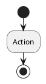

# Hướng dẫn sử dụng PlantUML cho Realtime Chat App

## 📖 Giới thiệu

Tài liệu này hướng dẫn cách xem, chỉnh sửa và export các sơ đồ hoạt động PlantUML cho dự án Realtime Chat App.

## 📁 Cấu trúc thư mục

```
docs/
├── plantuml/
│   ├── 01_authentication_flow.puml       # Xác thực người dùng
│   ├── 02_friend_management_flow.puml    # Quản lý bạn bè
│   ├── 03_realtime_chat_flow.puml        # Chat realtime
│   ├── 04_online_status_flow.puml        # Trạng thái online/offline
│   ├── 05_group_chat_flow.puml           # Quản lý nhóm chat
│   ├── 06_media_handling_flow.puml       # Xử lý media
│   ├── 00_all_diagrams.puml              # Tổng hợp tất cả
│   ├── README.md                          # Hướng dẫn chi tiết
│   ├── export_diagrams.sh                # Script export (Linux/Mac)
│   └── export_diagrams.bat               # Script export (Windows)
└── exports/
    ├── png/                               # Sơ đồ PNG
    ├── svg/                               # Sơ đồ SVG
    └── pdf/                               # Sơ đồ PDF
```

## 🚀 Cài đặt

### 1. VS Code (Khuyến nghị cho developer)

**Bước 1:** Cài đặt extension PlantUML
```
1. Mở VS Code
2. Nhấn Ctrl+Shift+X (hoặc Cmd+Shift+X trên Mac)
3. Tìm "PlantUML"
4. Cài đặt extension của "jebbs"
```

**Bước 2:** Cài đặt Java (nếu chưa có)
```bash
# macOS
brew install openjdk

# Ubuntu/Debian
sudo apt-get install default-jre

# Windows
choco install openjdk
```

**Bước 3:** Cài đặt Graphviz (tùy chọn, cho layout tốt hơn)
```bash
# macOS
brew install graphviz

# Ubuntu/Debian
sudo apt-get install graphviz

# Windows
choco install graphviz
```

### 2. Command Line

**macOS:**
```bash
brew install plantuml
```

**Ubuntu/Debian:**
```bash
sudo apt-get install plantuml
```

**Windows:**
```bash
choco install plantuml
```

### 3. Online (Không cần cài đặt)
Truy cập: https://www.plantuml.com/plantuml/uml/

## 👀 Xem sơ đồ

### Trong VS Code

**Cách 1: Preview**
1. Mở file `.puml`
2. Nhấn `Alt + D` (hoặc `Option + D` trên Mac)
3. Sơ đồ sẽ hiển thị bên cạnh

**Cách 2: Context Menu**
1. Mở file `.puml`
2. Click chuột phải
3. Chọn "Preview Current Diagram"

**Cách 3: Command Palette**
1. Nhấn `Ctrl+Shift+P` (hoặc `Cmd+Shift+P`)
2. Gõ "PlantUML: Preview"
3. Enter

### Online

1. Mở https://www.plantuml.com/plantuml/uml/
2. Copy nội dung file `.puml`
3. Paste vào editor
4. Xem kết quả realtime

### Command Line

```bash
# Xem một file
plantuml -tpng docs/plantuml/01_authentication_flow.puml

# Xem tất cả
plantuml -tpng docs/plantuml/*.puml
```

## 📤 Export sơ đồ

### Sử dụng Script (Khuyến nghị)

**Linux/Mac:**
```bash
cd docs/plantuml
chmod +x export_diagrams.sh
./export_diagrams.sh
```

**Windows:**
```cmd
cd docs\plantuml
export_diagrams.bat
```

Script sẽ tự động export tất cả sơ đồ sang PNG, SVG và PDF.

### Export thủ công trong VS Code

**Export một file:**
1. Mở file `.puml`
2. Nhấn `Ctrl+Shift+P` (hoặc `Cmd+Shift+P`)
3. Gõ "PlantUML: Export Current Diagram"
4. Chọn format: PNG, SVG, PDF, EPS, etc.

**Export tất cả:**
1. Nhấn `Ctrl+Shift+P`
2. Gõ "PlantUML: Export Workspace Diagrams"
3. Chọn format

### Export bằng Command Line

**PNG:**
```bash
plantuml -tpng docs/plantuml/*.puml -o ../exports/png/
```

**SVG (vector, chất lượng cao):**
```bash
plantuml -tsvg docs/plantuml/*.puml -o ../exports/svg/
```

**PDF:**
```bash
plantuml -tpdf docs/plantuml/*.puml -o ../exports/pdf/
```

**Tất cả cùng lúc:**
```bash
cd docs/plantuml
plantuml -tpng *.puml -o ../exports/png/
plantuml -tsvg *.puml -o ../exports/svg/
plantuml -tpdf *.puml -o ../exports/pdf/
```

## ✏️ Chỉnh sửa sơ đồ

### Cú pháp cơ bản

**Start và Stop:**


**If-Else:**
```plantuml
if (Điều kiện?) then (Có)
  :Hành động A;
else (Không)
  :Hành động B;
endif
```

**Repeat Loop:**
```plantuml
repeat
  :Hành động;
repeat while (Tiếp tục?) is (Có)
->Không;
```

**Swimlanes (Phân luồng):**
```plantuml
|Người dùng|
:Hành động của người dùng;

|Hệ thống|
:Hành động của hệ thống;
```

**Colors:**
```plantuml
#LightBlue:Hành động màu xanh;
#Pink:Hành động màu hồng;
```

**Notes:**
```plantuml
:Hành động;
note right
  Ghi chú ở bên phải
end note
```

**Fork (Parallel):**
```plantuml
fork
  :Luồng 1;
fork again
  :Luồng 2;
end fork
```

### Ví dụ hoàn chỉnh

```plantuml
@startuml Example
!theme vibrant
title Ví dụ Activity Diagram

|Người dùng|
start
:Nhập thông tin;

|Hệ thống|
if (Kiểm tra hợp lệ?) then (Có)
  #LightGreen:Xử lý thành công;
  note right
    Lưu vào database
  end note
else (Không)
  #Pink:Hiển thị lỗi;
  backward:Nhập lại;
endif

stop
@enduml
```

## 🎨 Themes và Styling

### Themes có sẵn

```plantuml
!theme vibrant      ' Màu sắc sống động (đang dùng)
!theme bluegray     ' Xanh xám chuyên nghiệp
!theme plain        ' Đơn giản, trắng đen
!theme sketchy      ' Phong cách vẽ tay
!theme cerulean     ' Xanh dương
!theme mars         ' Đỏ cam
```

### Custom colors

```plantuml
skinparam ActivityBackgroundColor #E8F5E9
skinparam ActivityBorderColor #4CAF50
skinparam ActivityFontColor #1B5E20
skinparam ActivityFontSize 14
```

### Arrow styles

```plantuml
--> Normal arrow
-[#red]-> Red arrow
-[dotted]-> Dotted arrow
-[bold]-> Bold arrow
-[dashed]-> Dashed arrow
```

## 🔍 Tips & Tricks

### 1. Auto-reload trong VS Code
- Extension PlantUML tự động reload khi save file
- Không cần refresh thủ công

### 2. Zoom trong Preview
- `Ctrl + Mouse Wheel` để zoom in/out
- `Ctrl + 0` để reset zoom

### 3. Export chất lượng cao
```bash
# SVG cho chất lượng tốt nhất (vector)
plantuml -tsvg file.puml

# PNG với DPI cao
plantuml -tpng -Sdpi=300 file.puml
```

### 4. Include files
```plantuml
!include common_styles.puml
!include 01_authentication_flow.puml
```

### 5. Variables
```plantuml
!$PRIMARY_COLOR = "#1e3a8a"
!$SUCCESS_COLOR = "#4ade80"

#$PRIMARY_COLOR:Action;
```

### 6. Debugging
```plantuml
' Comment: Dòng này sẽ bị bỏ qua

/' 
  Multi-line comment
  Có thể comment nhiều dòng
'/
```

## 🐛 Troubleshooting

### Lỗi: "Cannot find Java"
**Giải pháp:**
```bash
# Cài đặt Java
brew install openjdk  # macOS
sudo apt-get install default-jre  # Ubuntu
```

### Lỗi: "Graphviz not found"
**Giải pháp:**
```bash
# Cài đặt Graphviz
brew install graphviz  # macOS
sudo apt-get install graphviz  # Ubuntu
```

### Preview không hiển thị
**Giải pháp:**
1. Kiểm tra Java đã cài đặt: `java -version`
2. Restart VS Code
3. Kiểm tra PlantUML extension settings

### Export bị lỗi font
**Giải pháp:**
```bash
# Cài đặt font hỗ trợ Unicode
sudo apt-get install fonts-noto  # Ubuntu
```

## 📚 Tài liệu tham khảo

### Official Documentation
- [PlantUML Homepage](https://plantuml.com/)
- [Activity Diagram Guide](https://plantuml.com/activity-diagram-beta)
- [Theme Gallery](https://plantuml.com/theme)
- [Color Names](https://plantuml.com/color)

### Cheat Sheets
- [PlantUML Cheat Sheet](https://ogom.github.io/draw_uml/plantuml/)
- [Activity Diagram Syntax](https://plantuml.com/activity-diagram-beta)

### Community
- [PlantUML Forum](https://forum.plantuml.net/)
- [Stack Overflow](https://stackoverflow.com/questions/tagged/plantuml)
- [GitHub Issues](https://github.com/plantuml/plantuml/issues)

## 🎯 Best Practices

### 1. Đặt tên file
- Sử dụng prefix số: `01_`, `02_`, etc.
- Tên mô tả rõ ràng: `authentication_flow.puml`
- Lowercase với underscore

### 2. Structure
```plantuml
@startuml Title
!theme vibrant
title Tiêu đề sơ đồ

' Main content here

legend right
  ' Legend content
endlegend

note bottom
  ' Additional notes
end note

@enduml
```

### 3. Comments
- Thêm comments giải thích logic phức tạp
- Sử dụng notes cho thông tin quan trọng
- Group related actions

### 4. Colors
- Sử dụng màu nhất quán
- Màu xanh: Success/Normal flow
- Màu đỏ: Error/Warning
- Màu vàng: Important/Special

### 5. Swimlanes
- Phân chia rõ ràng giữa actors
- Người dùng, Hệ thống, Database, etc.

## 🤝 Contributing

Khi thêm sơ đồ mới:
1. Đặt tên theo format: `XX_feature_name_flow.puml`
2. Sử dụng theme `vibrant`
3. Thêm title và legend
4. Thêm notes giải thích
5. Test export sang PNG/SVG
6. Cập nhật README

## 📄 License
MIT License

---

**Tạo bởi:** Kiro AI Assistant  
**Ngày tạo:** May 7, 2026  
**Phiên bản:** 1.0.0
