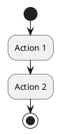

# Sơ đồ hoạt động PlantUML - Realtime Chat App

Thư mục này chứa tất cả các sơ đồ hoạt động (Activity Diagrams) được viết bằng PlantUML cho hệ thống chat realtime.

## 📋 Danh sách Sơ đồ

### 1. [Authentication Flow](./01_authentication_flow.puml)
**File:** `01_authentication_flow.puml`  
**Mô tả:** Quy trình đăng nhập, đăng ký và quản lý phiên làm việc

**Tính năng:**
- Kiểm tra trạng thái đăng nhập
- Đăng nhập với email/password
- Đăng ký tài khoản mới
- Khởi tạo kết nối Realtime
- Cập nhật trạng thái online

---

### 2. [Friend Management Flow](./02_friend_management_flow.puml)
**File:** `02_friend_management_flow.puml`  
**Mô tả:** Quản lý quan hệ bạn bè và lời mời kết bạn

**Tính năng:**
- Tải danh sách bạn bè
- Gửi/Nhận lời mời kết bạn
- Chấp nhận/Từ chối lời mời
- Gợi ý kết bạn (mutual friends)
- Xóa bạn bè
- Xem bạn bè online

---

### 3. [Realtime Chat Flow](./03_realtime_chat_flow.puml)
**File:** `03_realtime_chat_flow.puml`  
**Mô tả:** Gửi/Nhận tin nhắn realtime với Supabase

**Tính năng:**
- Tạo cuộc trò chuyện mới
- Gửi/Nhận tin nhắn realtime
- Typing indicator ("đang gõ...")
- Gửi media (ảnh, video, file)
- Trả lời tin nhắn (Reply)
- Đánh dấu đã đọc
- Broadcast mechanism

---

### 4. [Online Status Flow](./04_online_status_flow.puml)
**File:** `04_online_status_flow.puml`  
**Mô tả:** Theo dõi và cập nhật trạng thái online/offline

**Tính năng:**
- Heartbeat mechanism (30 giây/lần)
- Phát hiện mất kết nối
- Tự động kết nối lại
- Subscribe trạng thái bạn bè
- Hiển thị "Hoạt động X phút trước"
- Cập nhật last_seen

---

### 5. [Group Chat Flow](./05_group_chat_flow.puml)
**File:** `05_group_chat_flow.puml`  
**Mô tả:** Tạo và quản lý nhóm chat

**Tính năng:**
- Tạo nhóm mới
- Xem thông tin nhóm
- Chỉnh sửa thông tin (admin)
- Thêm/Xóa thành viên (admin)
- Rời nhóm
- Xóa nhóm (creator)
- Chat trong nhóm

---

### 6. [Media Handling Flow](./06_media_handling_flow.puml)
**File:** `06_media_handling_flow.puml`  
**Mô tả:** Upload, download và quản lý media

**Tính năng:**
- Gửi ảnh (camera/thư viện)
- Gửi video (quay/chọn)
- Ghi âm và gửi audio
- Gửi file documents
- Compression & thumbnail
- Progress bar
- Download & share
- Xóa media

---

## 🎨 Cách xem sơ đồ

### 1. VS Code (Khuyến nghị)
Cài đặt extension **PlantUML**:
```
ext install jebbs.plantuml
```

**Cách sử dụng:**
1. Mở file `.puml`
2. Nhấn `Alt + D` để xem preview
3. Hoặc click chuột phải → "Preview Current Diagram"

**Export:**
- `Ctrl + Shift + P` → "PlantUML: Export Current Diagram"
- Chọn format: PNG, SVG, PDF

### 2. Online Editor
Truy cập: https://www.plantuml.com/plantuml/uml/

**Cách sử dụng:**
1. Copy nội dung file `.puml`
2. Paste vào editor
3. Xem kết quả realtime
4. Download PNG/SVG

### 3. IntelliJ IDEA / Android Studio
Cài đặt plugin **PlantUML integration**

### 4. Command Line
Cài đặt PlantUML:
```bash
# macOS
brew install plantuml

# Ubuntu/Debian
sudo apt-get install plantuml

# Windows (với Chocolatey)
choco install plantuml
```

**Generate PNG:**
```bash
plantuml docs/plantuml/*.puml
```

**Generate SVG:**
```bash
plantuml -tsvg docs/plantuml/*.puml
```

---

## 📦 Export tất cả sơ đồ

### Script để export tất cả
Tạo file `export_diagrams.sh`:

```bash
#!/bin/bash

# Export to PNG
plantuml -tpng docs/plantuml/*.puml -o ../exports/png/

# Export to SVG
plantuml -tsvg docs/plantuml/*.puml -o ../exports/svg/

# Export to PDF
plantuml -tpdf docs/plantuml/*.puml -o ../exports/pdf/

echo "✅ Exported all diagrams!"
```

Chạy script:
```bash
chmod +x export_diagrams.sh
./export_diagrams.sh
```

---

## 🎨 Theme và Style

Các sơ đồ sử dụng theme **vibrant** của PlantUML:
```plantuml
!theme vibrant
```

**Màu sắc được sử dụng:**
- 🔵 `#LightBlue` - Luồng chính
- 🔴 `#LightCoral` - Luồng phụ
- 🟡 `#LightYellow` - Tính năng đặc biệt
- 🟣 `#Lavender` - Background process
- 🟢 `#LightGreen` - Thành công
- 🔴 `#Pink` - Lỗi/Cảnh báo
- ⚫ `#Gray` - Offline/Disabled

---

## 📝 Cú pháp PlantUML

### Activity Diagram Basics



### If-Else
```plantuml
if (condition?) then (yes)
  :Action A;
else (no)
  :Action B;
endif
```

### Repeat Loop
```plantuml
repeat
  :Action;
repeat while (continue?) is (yes)
->no;
```

### Fork (Parallel)
```plantuml
fork
  :Action 1;
fork again
  :Action 2;
end fork
```

### Swimlanes
```plantuml
|User|
:User action;

|System|
:System action;
```

### Notes
```plantuml
:Action;
note right
  This is a note
end note
```

### Colors
```plantuml
#LightBlue:Action with color;
```

---

## 🔧 Tùy chỉnh

### Thay đổi theme
```plantuml
!theme vibrant
!theme bluegray
!theme plain
!theme sketchy-outline
```

### Custom colors
```plantuml
skinparam ActivityBackgroundColor #E8F5E9
skinparam ActivityBorderColor #4CAF50
skinparam ActivityFontColor #1B5E20
```

### Arrow styles
```plantuml
--> Normal arrow
-[#red]-> Red arrow
-[dotted]-> Dotted arrow
-[bold]-> Bold arrow
```

---

## 📚 Tài liệu tham khảo

- [PlantUML Official Documentation](https://plantuml.com/)
- [PlantUML Activity Diagram](https://plantuml.com/activity-diagram-beta)
- [PlantUML Themes](https://plantuml.com/theme)
- [PlantUML Cheat Sheet](https://ogom.github.io/draw_uml/plantuml/)

---

## 🤝 Contributing

Khi thêm sơ đồ mới:
1. Đặt tên file theo format: `XX_feature_name_flow.puml`
2. Sử dụng theme `vibrant`
3. Thêm title và legend
4. Thêm notes giải thích
5. Cập nhật README này

---

## 📄 License
MIT License

---

**Tạo bởi:** Kiro AI Assistant  
**Ngày tạo:** May 7, 2026  
**Phiên bản:** 1.0.0
